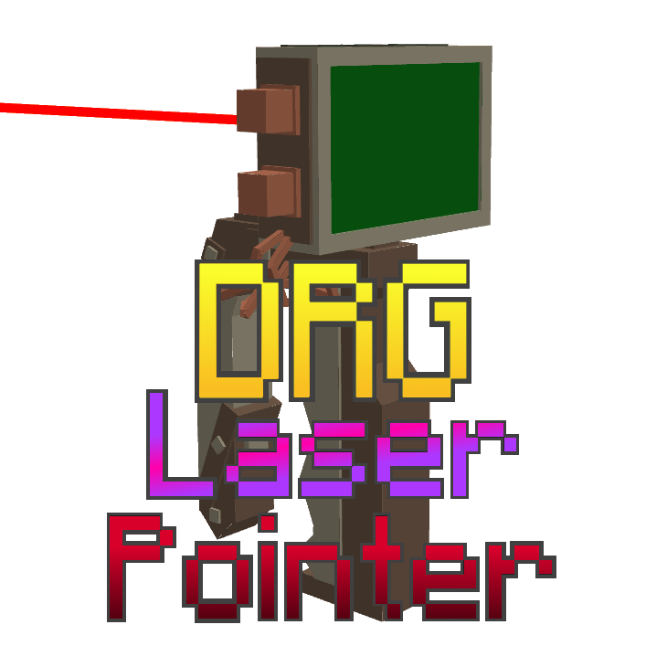

Add the laser pointer from Deep Rock Galactic into Minecraft.

ROCK AND STONE!!!

Players can remotely mark blocks, mobs, and non-living entities to alert other players.
Shift + scroll wheel changes the laser color.
When marking gold blocks or mushrooms, there will be dwarf voice lines.

In the config file, you can adjust the maximum marking distance and choose whether the marker shape is a cube or a sphere.

1.1.2 update

When there is a laser pointer in the backpack, hold down the z key to temporarily switch the pointer to the main hand